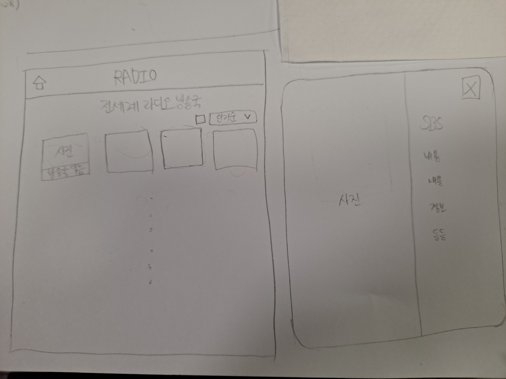

# 규칙정하기

### branch

```markdown
- 용어설명
  master : 제품으로 출시될 수 있는 브랜치
  develop : 다음 출시 버전을 개발하는 브랜치
  feat : 기능을 개발하는 브랜치

- 구조
  feat/[feature name]
```

```markdown
ex)
feat/add-layout
```

### commit

```markdown
- 용어설명
  feat : 새로운 기능 추가
  fix : 버그 수정
  docs : 문서 수정
  style : 코드 formatting, 세미콜론(;) 누락, 코드 변경이 없는 경우
  refactor : 코드 리팩토링
  test : 테스트 코드, 리팽토링 테스트 코드 추가
  chore : 빌드 업무 수정, 패키지 매니저 수정

- 구조
  [관련 용어]: [처리한 내용]

- 주의사항
  commit 할때는 - 대신 한칸 띄워서 부가설명 해주는 것이 좋음
```

```markdown
ex)
feat: add layout
docs: fix readme
```

# 프로젝트 설명 및 디자인

전세계 라디오 방송국의 현황(인기있는 방송국, 폐쇄된 방송국 등)에 대해 살펴보고 해당 방송국을 클릭하면 상세페이지를 모달로 확인이 가능한 홈페이지



# TODO-LIST

- [x] 페이지 레이아웃(2h / 3h) (feat/add-layout)

- [x] API 연동해서 리스트 페이지 뿌리기(4h / 6h) (feat/add-list-use-api)

- [x] 인기순으로 리스트 정렬(3h / 6h) (feat/filter-popular-list)

- [x] 체크박스 클릭 시 현재 운영 중인 방송국만 보이기(2h / 8h) (feat/filter-operating-stations-list)

- [ ] 리스트 페이지 무한스크롤 적용(2h)

- [x] 해당 리스트 호버 시 음악 재생(5h) => 디테일페이지에서 음악 재생되므로 생략

- [ ] 해당 리스트 클릭 시 모달 띄우기(3h)

- [x] 상세페이지 구현(4h / 4h) (feat/add-detail)

- [ ] 신규 라디오 방송국 등록 페이지 구현(5h)
